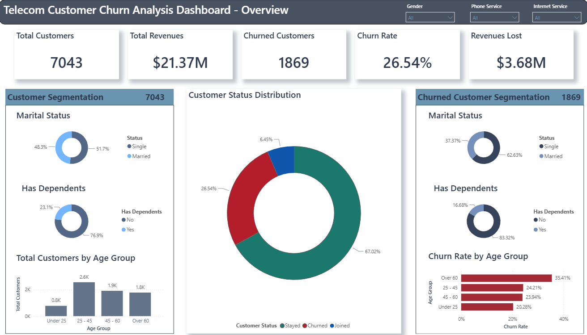
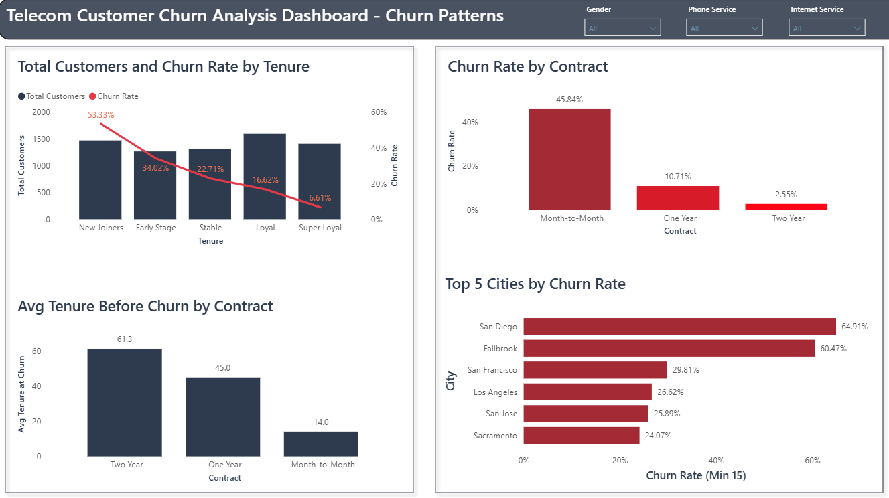
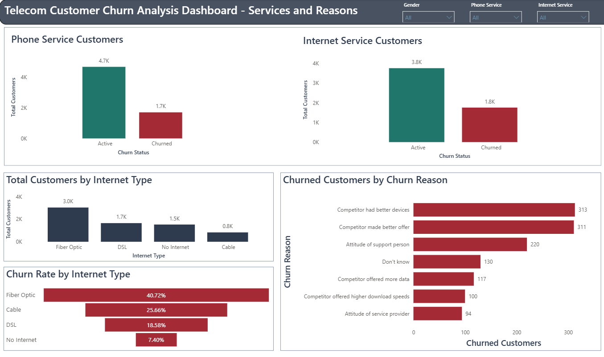

# Telecom Customer Churn Analysis — Power BI Dashboard

An end-to-end churn analysis project built on a 7,043-customer telecom dataset, designed around a **Who → When → Why** narrative structure across three dashboard pages.



---

## 📌 Business Questions

**Framing question:** How big is the problem, really? (number of customers affected, and the overall risk level)

1. Which gender and age group churns the most?
2. Does marital status / having dependents affect churn?
3. What are the top 5 cities by churn rate, and does population play a role?
4. At what point in a customer's lifecycle (tenure) does churn peak?
5. Does contract type (Month-to-Month / One Year / Two Year) affect churn rate?
6. What are the most common churn reasons, and what do they correlate with?
7. Does internet service type affect churn? *(optional / supporting question)*

**Closing question:** Now that we understand who churns, when, and why — what does this actually cost the business, and what should we do about it?

---

## 🗂️ Dataset

- **telecom_customer_churn.csv** — 7,043 rows, customer-level data (demographics, services, billing, churn status/reason)
- **telecom_zipcode_population.csv** — 1,671 rows, Zip Code → Population lookup table

**Columns kept:** Customer ID, Gender, Age, Married, Number of Dependents, City, Zip Code, Latitude, Longitude, Number of Referrals, Tenure in Months, Offer, Phone Service, Internet Service, Internet Type, Contract, Monthly Charge, Total Revenue, Total Refunds, Payment Method, Customer Status, Churn Category, Churn Reason.

Columns were selected deliberately against the business questions above, not kept by default.

---

## 🧹 Data Cleaning (Power Query)

| Issue | Decision |
|---|---|
| Nulls in service columns (Online Security, Streaming, etc.) | Left as-is / labeled — these are **structurally missing** (customer has no internet service), not data errors |
| 114 rows with negative `Monthly Charge` | Flagged with a new column `Has Credit Adjustment` (Yes/No) instead of altering or deleting the original value — preserves the raw data while documenting the anomaly |
| `Zip Code` | Kept as Text (not Number) to preserve leading zeros and prevent unintended aggregation |

---

## 🔗 Data Model

Star schema: `telecom_zipcode_population` (1) → `Churn` (many), joined on **Zip Code**, single-direction cross-filter.

---

## 🧮 Key Calculated Columns

- **`Has Dependents`** — Yes/No from `Number of Dependents > 0`
- **`Age Group S`** and **`Age Group Sort`** — a working solution built after running into a circular dependency error when sorting the original age bucket column. `Age Group S` holds the display label; `Age Group Sort` holds a numeric rank used purely to control display order without creating a self-referencing loop:

```dax
Age Group S = 
SWITCH(
    TRUE(),
    'Churn'[Age] < 25, "Under 25",
    'Churn'[Age] < 45, "25 - 45",
    'Churn'[Age] < 60, "45 - 60",
    "Over 60"
)
```

```dax
Age Group Sort = 
SWITCH(
    TRUE(),
    'Churn'[Age Group S] = "Under 25", 4,
    'Churn'[Age Group S] = "25 - 45", 3,
    'Churn'[Age Group S] = "45 - 60", 2,
    'Churn'[Age Group S] = "Over 60", 1
)
```

- **`Tenure Group`** — New Joiner (0-6mo) / Early Stage (7-12mo) / Stable (13-24mo) / Loyal (25-48mo) / Super Loyal (49-72mo)
- **`Churn Status`** — collapses Stayed + Joined into "Active" vs "Churned", for binary comparisons

## 📐 Key DAX Measures

Standard measures: `Total Customers`, `Churned Customers`, `Churn Rate`, `Revenue Lost`, `Avg. Monthly Charges`, `Avg. Months Spent`.

Two measures reflect a deliberate methodological choice and are included in full below:

**Average tenure of customers who actually churned, segmented by contract type** — a genuine timing metric, distinct from just showing churn rate by contract:

```dax
Avg Tenure at Churn = 
CALCULATE(
    AVERAGE('Churn'[Tenure in Months]),
    'Churn'[Customer Status] = "Churned"
)
```

**Churn Rate that suppresses small, statistically unreliable samples** — used for the "Top 5 Cities by Churn Rate" chart, so a city with just 2 customers (both churned) doesn't misleadingly show a 100% rate:

```dax
Churn Rate (Min 15) = 
VAR Total = [Total Customers]
VAR Rate = [Churn Rate]
RETURN
IF(Total >= 15, Rate, BLANK())
```

---

## ⚠️ Methodological Decisions Worth Noting

**1. Rate vs. Count for city-level analysis.**
Raw churn counts favor large cities by default (more customers → more churners, regardless of whether there's an actual local problem). Ranking cities by **Churn Rate**, with a minimum sample size of 15 customers, surfaces a different and more actionable story than ranking by raw count alone — smaller cities with a genuinely high churn rate would otherwise be invisible next to large cities with an average rate.

**2. Composition vs. Rate.**
A clear distinction is kept throughout between "what % of our customers are married" (composition) and "what % of married customers churned" (rate) — these answer different questions and are shown separately, not conflated.

**3. Contract Type is a "Why," not a "When."**
Contract type describes a service commitment, not a point in the customer's timeline — it explains *why* a customer is free to leave, not *when* they actually did. The genuine timing metric used for the "When" page is `Avg Tenure at Churn by Contract Type`.

---

## 📊 Dashboard Structure (Who → When → Why)

**Page 1 — Overview**

KPIs, customer status distribution, and side-by-side comparison panels (All Customers vs. Churned Customers) across marital status, dependents, and age group.


**Page 2 — Churn Patterns**

Churn by tenure stage, churn rate by contract type, average tenure before churn by contract, and top 5 cities by churn rate — establishing *when* and *where* churn concentrates.



**Page 3 — Services and Reasons**

Phone/Internet service comparison, churn rate by internet type, and churn reason breakdown — the evidentiary layer explaining *why* customers leave.



---

## 🔑 Key Insights

- **26.54%** overall churn rate; **$3.68M** in lost revenue
- Among churned customers, **62.63%** are single and only **37.37%** are married; **83.32%** have no dependents vs. **16.68%** who do — single customers with no dependents are consistently the highest-risk segment
- **New Joiners (first 6 months)** churn at **53.33%**, and **Early Stage (7-12 months)** at **34.02%** — together these two groups account for roughly **65%** of all churned customers, making the first year the single most critical retention window
- **Month-to-Month** contracts churn at **45.84%**, compared to **10.71%** (One Year) and just **2.55%** (Two Year) — customers with no contractual commitment are by far the easiest to lose
- **32%** of Internet Service customers have left the company, and within that group **Fiber Optic** customers churn at the highest rate (**40.72%**)
- **Competitor-driven reasons** (better devices, better offers) dominate the churn reason breakdown, ahead of price or service attitude complaints
- **Employee attitude is a hidden second-place cause.** "Attitude of support person" (220) and "Attitude of service provider" (94) are separate reasons in the data, but both point to the same root cause — how staff treat customers. Combined, they represent 314 churned customers, making staff attitude the second-largest driver of churn after competitor activity, ahead of price or general dissatisfaction
- In cities like **Temecula, Lakewood, and Santa Rosa**, the company is losing a large share of its *local* customer base (churn rates well above the company average) — this isn't just a revenue problem. Losing a majority of customers in a specific area risks damaging local word-of-mouth reputation, which can compound the problem beyond what the revenue figures alone show

### 💡 Recommendations

1. **Retain Month-to-Month customers through commitment incentives.** Since Month-to-Month contracts churn at more than 4x the rate of One Year contracts, offer a discount or added service in exchange for switching to a longer-term plan.

2. **Build a structured onboarding/retention program for the first 6-12 months.** New Joiners and Early Stage customers together account for roughly 65% of all churn — this is the single highest-leverage window. Proactive check-ins, satisfaction surveys, or early-tenure loyalty perks could meaningfully reduce first-year attrition.

3. **Investigate local infrastructure and competitive pressure in high-risk cities.** Temecula, Lakewood, and Santa Rosa show churn rates nearly double the company average despite smaller customer bases — this pattern points to a localized cause (network quality, a competitor's recent expansion, weak local support) rather than a company-wide issue, and is worth a targeted on-the-ground investigation rather than a blanket fix.

4. **Review Fiber Optic service quality and pricing.** Despite being the premium internet tier, Fiber Optic customers churn at the highest rate of any internet type (40.72%) — this is counterintuitive and worth investigating whether the cause is price sensitivity, reliability issues, or a stronger competitor alternative specifically in this segment.

5. **Strengthen competitive positioning on devices and offers.** Since "competitor had better devices" and "competitor made better offer" are the leading churn reasons, a periodic competitive benchmarking process (device catalog, pricing, promotions) could help close the gap before it costs more customers.

6. **Invest in customer support and service staff training.** "Attitude of support person" and "attitude of service provider" together account for 314 churned customers — the second-largest cause of churn in the dataset. This points to a people/process issue rather than a product one, and is likely addressable through training, coaching, or revised service standards at a lower cost than competing on price or features.

---

## 🛠️ Tools Used

Power BI Desktop · Power Query (M) · DAX

---

## 👤 Author

Hesham — Finance graduate and Data Analyst, currently in the Digital Egypt Builders Initiative (DEBI) program.
